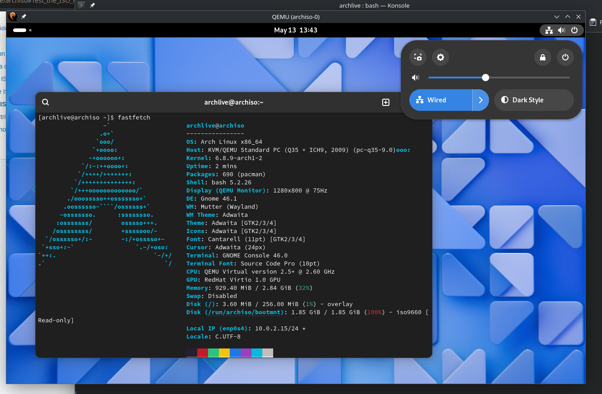

Typical arch build with gnome without any changes (nvidia closedsource driver included)
==========
the name speaks for itself

Features
-------
1. its cool
2. coolest desktop environment - gnome
3. works on real pc
4. not shit

what to type there?
